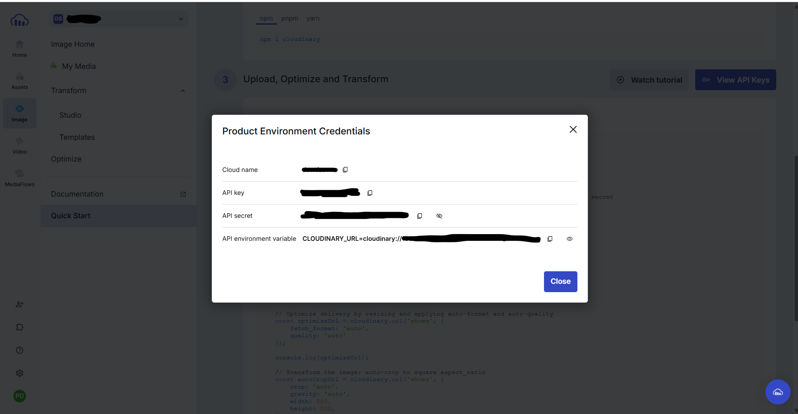
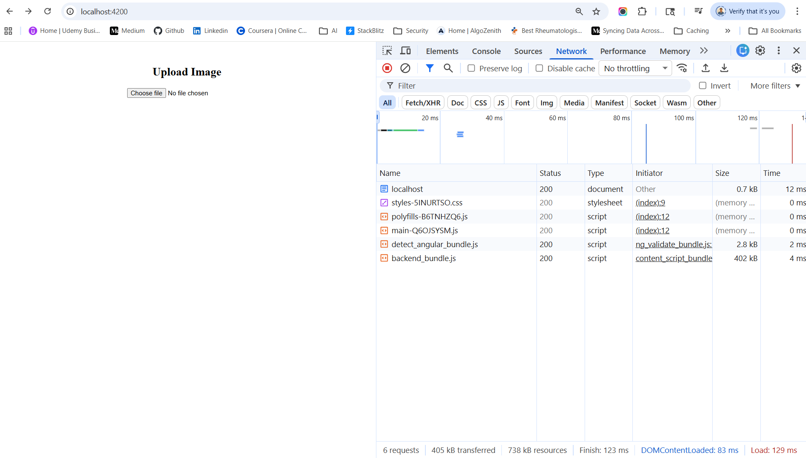
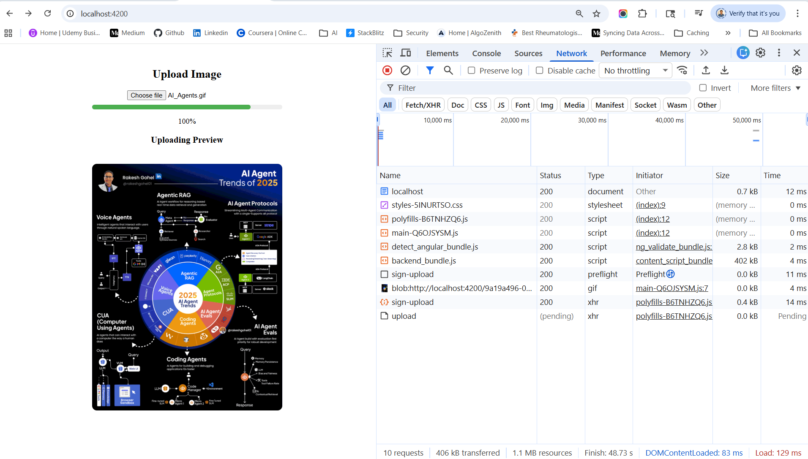
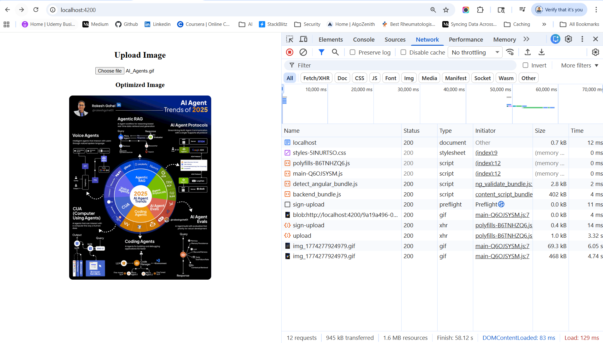
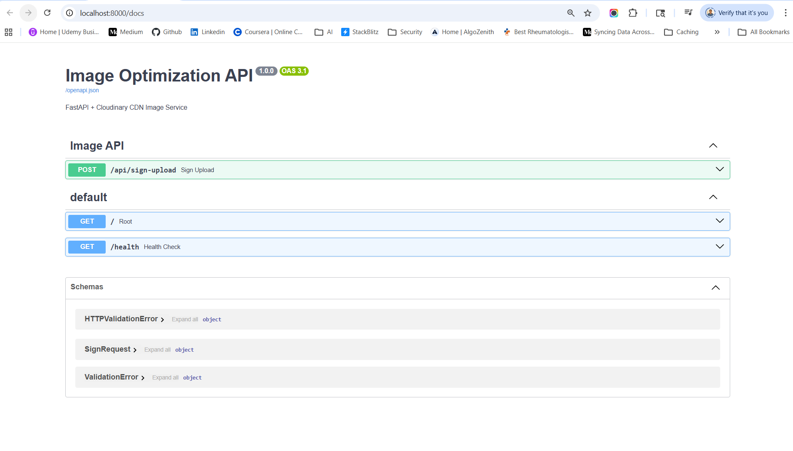

# angular-fastapi-cloudinary-cdn
CDN integration with Cloudinary in Angular 19 for Image Uploading & Optimization

## 🧠 Architecture (Signed Upload)
```
Angular App  ──► FastAPI (sign request) ──► Cloudinary
       │                                     ▲
       └────────────── upload ────────────────┘
```
👉 Backend only generates signature
👉 File goes directly to Cloudinary

## RUN Application
✅ 🔑 Step 1: Create / Login Account

Go to:
```
👉 https://cloudinary.com/
```
Sign up (free tier is enough) Or login if you already have account


Create a .env file inside root folder. then copy credentials & add inside .env
```
CLOUDINARY_CLOUD_NAME='demo123'
CLOUDINARY_API_KEY='123456789012345'
CLOUDINARY_API_SECRET='abcdefg123456'
```

✅ Run Both Frontend & Backend via Docker
--------------------------------------------------------------------------------
Since you already have Dockerfile + docker-compose.yml 👇

**🚀 Run everything**
```
docker-compose down
docker-compose up --build
```

👉 This will:
- Start backend (FastAPI)
- Start frontend (Angular + NGINX)

**🌐 Run Frontend**
```
http://localhost:4200
```






**🌐 Access backend**       
```
http://localhost:8000
```

**🔍 Test API**      
Open:
```
http://localhost:8000/docs
```
👉 Swagger UI (very useful)


Two APIs will be triggered
1. http://localhost:8000/api/sign-upload (POST)
2. https://api.cloudinary.com/v1_1/dswtizsvv/image/upload (POST)

## 🧱 Full Project Structure
```
project-root/
│
├── docker-compose.yml
├── .env                // For cloudinary api_key & api_secret
├── backend/
│   ├── Dockerfile
│   ├── requirements.txt
│   │
│   └── app/
│       ├── __init__.py
│       ├── main.py
│       ├── routes.py
│       ├── cloudinary_service.py
│
├── frontend/
│   ├── Dockerfile
│   ├── nginx.conf
│   ├── package.json
│   ├── angular.json
│   │
│   └── src/
│       ├── main.ts
│       ├── index.html
│       │
│       └── app/
│           ├── app.component.ts
│           ├── app.component.html
│           ├── app.component.scss
│           ├── optimized-image/
│               |──cloudinary.service.ts
│               |── optimized-image.component.ts
│               |── optimized-image.component.html
│               └── optimized-image.component.scss
│
└── README.md
```

## 🧠 Why node_modules is NOT in your frontend folder

You are running:
```
docker-compose up --build
```
👉 So:

- 📦 npm install runs inside Docker container
- ❌ NOT on your local machine
- 👉 That’s why you don’t see node_modules in frontend/

## 🔐 Why Signed Upload is Important
| Feature          | Unsigned            | Signed         |
| ---------------- | ------------------- | -------------- |
| Security         | ❌ Public abuse risk | ✅ Secure       |
| File control     | ❌ No validation     | ✅ Full control |
| Auth required    | ❌ No                | ✅ Yes          |
| Production ready | ❌                   | ✅              |


## ⚡ Pro Architecture Upgrade (What top companies do)
✅ Angular → Direct upload (Cloudinary CDN edge)    
✅ Backend → Only signature (lightweight)   

✅ Use transformations:
```
w_400,q_auto,f_auto
```
✅ Store only public_id in DB (not full URL)    


## 🔥 API Endpoints Summary
| Method | Endpoint                  | Purpose                |
| ------ | ------------------------- | ---------------------- |
| POST   | `/upload`                 | Upload single image    |
| POST   | `/upload-multiple`        | Upload multiple images |
| DELETE | `/delete/{public_id}`     | Delete image           |
| GET    | `/image-url/{public_id}`  | Get optimized CDN URL  |
| GET    | `/responsive/{public_id}` | Get responsive sizes   |
| GET    | `/details/{public_id}`    | Get metadata           |


## 🧠 Why These Packages?
**requirements.txt inside backend folder**

| Package            | Purpose                  |
| ------------------ | ------------------------ |
| `fastapi`          | API framework            |
| `uvicorn`          | ASGI server              |
| `python-multipart` | File uploads             |
| `cloudinary`       | CDN + image optimization |
| `python-dotenv`    | Load `.env`              |
| `pydantic`         | Validation               |
| `httpx`            | External API calls       |

## npm ci vs npm install
| Command     | Requires package-lock.json? |
| ----------- | --------------------------- |
| npm ci      | ✅ YES                       |
| npm install | ❌ NO                        |

